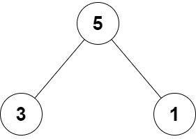

# Root Equals Sum of Children

<br>

## You are given the root of a binary tree that consists of exactly 3 nodes: the root, its left child, and its right child.

## Return true if the value of the root is equal to the sum of the values of its two children, or false otherwise.

<br>

## [Leetcode](https://leetcode.com/problems/root-equals-sum-of-children/)

<br>

### Example 1:


```
Input: root = [10,4,6]
Output: true
Explanation: The values of the root, its left child, and its right child are 10, 4, and 6, respectively.
10 is equal to 4 + 6, so we return true.
```

<br>

### Example 2:



```
Input: root = [5,3,1]
Output: false
Explanation: The values of the root, its left child, and its right child are 5, 3, and 1, respectively.
5 is not equal to 3 + 1, so we return false.
```

<br>

### Constraints:

```
The tree consists only of the root, its left child, and its right child.
-100 <= Node.val <= 100
```

### Tags: [TREE](https://leetcode.com/tag/tree/), [BINARY TREE](https://leetcode.com/tag/binary-tree/)
