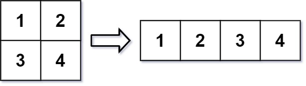

# Reshape the Matrix

<br>

## In MATLAB, there is a handy function called reshape which can reshape an m x n matrix into a new one with a different size r x c keeping its original data.

## You are given an m x n matrix mat and two integers r and c representing the number of rows and the number of columns of the wanted reshaped matrix.

## The reshaped matrix should be filled with all the elements of the original matrix in the same row-traversing order as they were.

## If the reshape operation with given parameters is possible and legal, output the new reshaped matrix; Otherwise, output the original matrix.

<br>

## [LeetCode](https://leetcode.com/problems/reshape-the-matrix/)

<br>

### Example 1:


```
Input: mat = [[1,2],[3,4]], r = 1, c = 4
Output: [[1,2,3,4]]
```

<br>

### Example 2:

```
Input: mat = [[1,2],[3,4]], r = 2, c = 4
Output: [[1,2],[3,4]]
``` 

<br>

### Constraints:
```
m == mat.length
n == mat[i].length
1 <= m, n <= 100
-1000 <= mat[i][j] <= 1000
1 <= r, c <= 300
```

<br>

### Tags: [ARRAY](https://leetcode.com/tag/array/), [MATRIX](https://leetcode.com/tag/matrix/), [SIMULATION](https://leetcode.com/tag/simulation/)

<br>
<br>
<br>
<br>
<br>

#### HINTS:

<br>

- Do you know how 2d matrix is stored in 1d memory? Try to map 2-dimensions into one.
- M[i][j]=M[n*i+j] , where n is the number of cols. This is the one way of converting 2-d indices into one 1-d index. Now, how will you convert 1-d index into 2-d indices?
- Try to use division and modulus to convert 1-d index into 2-d indices.
- M[i] => M[i/n][i%n] Will it result in right mapping? Take some example and check this formula.
